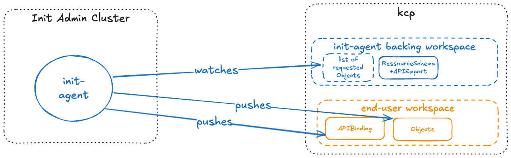

# Init Agent Concept

This document describes the concept of an initialization agent for kcp.

It is intended for end-users who do not have the necessary Go skills to write their own initializers, but would still like to define a generic list of objects which should be available for workspaces before they become ready and

On a high level, the agent allows a persona to define a list of APIs and APIObjects, which should be created before a kcp workspace is accessible. Another persona then is able to create new workspaces based on the aforementioned type, which triggers the agent to fill the workspace with the requested APIs and APIObjects.

## Terminologies

* Init-admin: This term describes a persona who is initially configuring the init-agent, telling the agent what objects to sync to and where. The personas main responsibility is in the initial-setup of the agent
* End-user: This term describes a person who will be creating new workspaces in kcp and expects them to be prefilled with data and objects. In general we expected a variety of end-users with multiple workspaces each.

## Assumptions

* the service should be provided constantly, whenever a new workspace with a certain identification is being spun up, the init-agent makes sure that all requested objects and apis get synched
* the workspace should not be accessible before the controller has not finished initialization
* multiple instances of the agent can be combined, but are clearly separated using different initializers -> each agent owns exactly one initializer
* the agent can be run in a Kubernetes cluster alongside other workload
* templating is supported before an object gets synched to the workspace
* custom APIs are supported
* allowing for workspace hierarchy

## High-Level Architecture



## Intended Workflow

Initial setup (one time):

1. Init-admin creates a WorkspaceType in kcp with initializers enabled and generates a suitable Kubeconfig for the resulting initializer VirtualWorkspace
1. Init-admin creates a Workspace, where the init-agent can later publish its ResourceSchemas and APIExports and generates a suitable Kubeconfig for it
1. Init-admin deploys the init-agent into their Kubernetes cluster and passes in the kubeconfigs from the previous steps. *Editor Note: Currently I think this is the only way to use the [initializingworkspaces multicluster-provider](https://github.com/kcp-dev/multicluster-provider), there does not seem to be any handling for sharding; So we should discuss whether we might want to build sharding into the multicluster provider before starting to write this controller*
1. Init-admin configures at least one InitTarget (see CRDs below) and optionally InitTemplates in the init-agent backing workspace

Operator in Action (bootstrap mode):

1. An end-user creates a workspace of the aforementioned WorkspaceType
1. Init-agent gets a watch event, fetches its InitEvent and starts reconciling:
    1. Init-agent fetches the InitTarget, goes through all the sources in order
    1. Init-agent first looks for any CRDs in a source and copies them over to the target workspace and waits for APIs to be available
    1. Init-agent looks for any APIBindings in a sources, copies them over and waits for APIs to be available
    1. Init-agent parses all namespaces in a source and creates any missing namespaces
    1. Init-agent creates any other requested objects
1. Init-agent removes its initializer from the list
1. (Assuming init-agents initializer was the last initializer): The end-user workspace gets marked as ready and is available to receive requests

Operator in Action (lifecycle mode):

1. In configurable intervals, the init-agent goes through its InitTargets and repeats the aforementioned reconciliation loop

## CRDs

In order for the init-agent to support different WorkspaceTypes, we need a mechanism to precisely tell it which APIs and Objects it should create upstream. We refer to this as the `InitTarget`:

```yaml
apiVersion: initialization.kcp.io/v1
kind: InitTarget
spec:
  workspaceTypeRef:
    name: myworkspacetype
    path: root
  sources:
    - type: initTemplate
      name: myTemplate
      namespace: myNamespace
```

For the initial version of the agent, `initTemplate` is the only type of source for `.spec.sources`. We purposefully keep the API flexible in this regard, so future types could be added (e.g. templateWorkspace).
For any objects mentioned in `.spec.sources`, the init-agent will automatically ensure that the corresponding APIs are available in the workspace via an APIExport+APIBinding. The init-agent will create any missing namespaces. The `InitTarget` is intended to be used in 1:n relationship with workspaces. As a result, the init-agent should log any issues while synching directly instead of pasting them as events in the InitTarget. This also helps to not overfill the object on large installations.

In order to allow for full custom templating of all fields - including fields like `.metadata.name` - we need to have a wrapping Template resource. As a templating engine, Go Template in conjunctions with sprig is used:

```yaml
apiVersion: initialization.kcp.io/v1
kind: InitTemplate
metdata:
  name: myTemplate
spec:
  # TODO (implementation detail): Do we want this to be free or structured text
  text: |
    apiVersion: v1
    kind: Secret
    metadata:
      name: {{ .upstream.workspaceName }}-my-secret
    data:
      info: "some super secret info"
```

In the initial version of the agent, the following variables should be available:

* WorkspaceName
* LogicalClusterID

## Considered Downsides

### API CRD maintenance

By design, InitTemplates abstract away the need to have the API available on the cluster in order to make full templating possible and skip any OpenAPISchema validation. Specifically, InitTemplates can be created in the backing workspace successfully, even if no API matching the object described in `.spec.text` exists. Additionally any object created downstream may be invalid. However given our current requirement of full-text templating, we don't see an elegant way to work around this. What is possible theoretically is that a webhook would deny any InitTemplates whose inferred APIs are not yet available. This should be considered separately of the main controller of this agent.

### Randomness in templating

We have considered to offer random string generation in templating. To make this work, we need a reliable mechanism to compare old and new versions of a manifest, that also accounts for randomness. We considered using an approach like helm, where the rendered version of a manifest is stored. However the big downside of this approach is that we would need to generate tons of shadow manifests, which will clog up the api-server and is not in line with the scaling ambitions of this project. Additionally we also considered an approach where we would try to identify random fields and skip them for comparison. However this is not possible, as templating also allows conditional statements (e.g. if statements), which in conjunction with randomness are tough to automatically render and compare to old versions.

If at a later point in time we do want to support random string generation, we can consider adding it via seed freezing.

As a result, The initial version of the templating will not support randomness (e.g. via random funcs or current time funcs).
